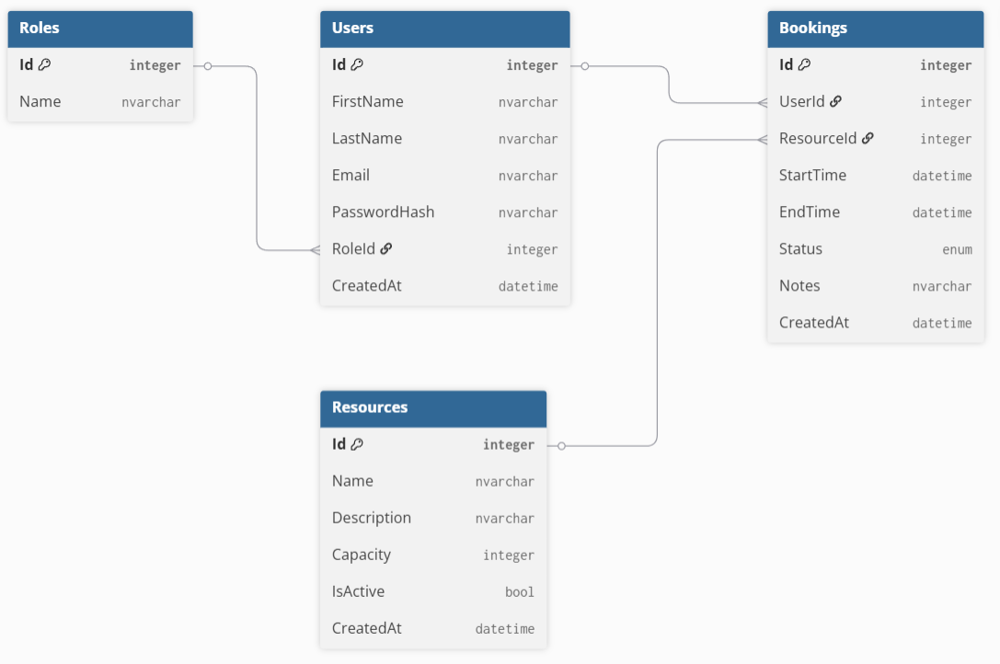

# BookingSystem API

A RESTful backend system built with ASP.NET Core for managing bookings, users, roles, and resources.

## Purpose
This project simulates a real-world booking system where users can reserve resources while ensuring data integrity and preventing conflicts.

The goal was to design a clean, maintainable backend with clear separation of concerns and realistic business rules.

## Key Features
- Booking management with conflict detection (no overlapping bookings)
- Relational data model (Users, Roles, Resources, Bookings)
- Validation rules to ensure data integrity
- Layered architecture (Controllers, Services, DTOs)
- Pagination and filtering support

---

## Features

- Partial CRUD for:
  - Bookings
  - Users
  - Roles
  - Resources
- Foreign key relationships
- DTO pattern implemented
- Swagger UI for testing

---

## Tech Stack

- ASP.NET Core Web API
- Entity Framework Core **10.0.7**
- Swagger / OpenAPI
- C#

---

## Important (Versioning)

This project requires:

- .NET SDK (compatible with the project)
- Entity Framework Core **10.0.7**

All EF Core packages must use the **same version**,  
otherwise the project may fail at build or runtime.
```PowerShell
dotnet add package Microsoft.EntityFrameworkCore.SqlServer --version 10.0.7
dotnet add package Microsoft.EntityFrameworkCore.Tools --version 10.0.7
dotnet add package Microsoft.EntityFrameworkCore.Design --version 10.0.7
```
---

## ER Diagram



---

## Data Model

- A **User** has one **Role**
- A **Booking** belongs to one **User**
- A **Booking** uses one **Resource**

---

## API Endpoints

### Bookings
- `GET /api/bookings`
- `GET /api/bookings?page=1&pageSize=10`
- `GET /api/bookings?resourceId=1`
- `GET /api/bookings?userId=1`
- `GET /api/bookings?fromDate=2026-05-01&toDate=2026-05-31`
- `POST /api/bookings`
- `PATCH /api/bookings/{id}/cancel`
- `GET /api/bookings/{id}`
- `PUT /api/bookings`
- `DELETE /api/bookings`

### Users
- `GET /api/users`
- `POST /api/users`
- `GET /api/users/{id}`
- `PUT /api/users`
- `DELETE /api/users`

### Roles
- `GET /api/roles`
- `POST /api/roles`
- `GET /api/roles/{id}`
- `PUT /api/roles`
- `DELETE /api/roles`

### Resources
- `GET /api/resources`
- `POST /api/resources`
- `GET /api/resources/{id}`
- `PUT /api/resources`
- `DELETE /api/resources`

---
## Booking Business Rules & Validation

The API enforces a set of validation rules to ensure data integrity and prevent invalid or conflicting bookings.

### Business Rules

The following rules apply:

1. **Valid Time Range**
   - `StartTime` must be earlier than `EndTime`
   - Returns `400 Bad Request` if invalid

2. **Valid StartTime Range**
   - `StartTime` must be in the future.
   - Returns `400 Bad Request` if invalid

3. **Role Must Exist**
   - The provided `RoleId` must exist in the system
   - Returns `404 Not Found` if role does not exist

4. **User Must Exist**
   - The provided `UserId` must exist in the system
   - Returns `404 Not Found` if user does not exist

5. **User `Email` Must be Unique**
   - The provided `Email` is not already in use.
   - Returns `409 Conflict` if the provided `Email` already exist in the system

6. **Resource Must Exist**
   - The provided `ResourceId` must exist in the system
   - Returns `404 Not Found` if resource does not exist

7. **Booking Must Exist**
   - The provided `BookingId` must exist in the system
   - Returns `404 Not Found` if booking does not exist

8. **The requested role to be deleted has no users**
   - The provided `RoleId` to be deleted does not have any users
   - Returns `409 Conflict` if any users are detected

9. **The requested user to be deleted has no bookings**
   - Provided `UserId` to be deleted does not have any bookings
   - Returns `409 Conflict` if booking is detected

10. **The requested resource to be deleted has no bookings**
    - The provided `ResourceId` to be deleted does not have any bookings
    - Returns `409 Conflict` if booking is detected

11. **No Overlapping Bookings**
    - A resource cannot be double-booked within overlapping time ranges
    - Returns `409 Conflict` if overlap is detected

12. **The requested resource to be booked must be Active**
    - The resource must have `IsActive = true`
    - Returns `400 Bad Request` if inactive

13. **The requested role name to be created should not already be in use**
    - A newly created role should have an unique name
    - Returns `409 Conflict` if a role name already exists in the system

14. **A booking cannot be cancelled more than once**
    - The specified `BookingId` must not already have the status "Cancelled"
    - Returns 400 Bad Request if the booking is already cancelled
---

**Successful Booking**

   For creating a booking (`POST /api/bookings`):
   - If the validations 1., 2., 4., 6., 11., 12. pass, the booking is created successfully
   - Returns `201 Created` with the created booking

   For Cancelling a booking (`PATCH /api/bookings/{id}/cancel`):
   - If the validations 7. and 14. pass, the booking is Cancelled successfully
   - Returns `204 No Content`

   For updating an existing booking (`PUT /api/bookings`):
   - If the validations 1., 2., 4., 6., 11., 12. pass, the existing booking is updated successfully
   - Returns `204 No Content`

   For deleting an existing booking (`DELETE /api/bookings`):
   - If validation 7. pass, the existing booking is deleted successfully
   - Returns `204 No Content`

---

**Successful Resource**

   For creating a resource (`POST /api/resources`):
   - No validations need to be passed, and the resource will be created successfully
   - Returns `201 Created` with the created resource

   For updating an existing resource (`PUT /api/resources`):
   - If validation 6. pass, the existing resource is updated successfully
   - Returns `204 No Content`

   For deleting an existing resource (`DELETE /api/resources`):
   - If validation 6. and 10. pass, the existing resource is deleted successfully
   - Returns `204 No Content`

---

**Successful User**

   For creating a user (`POST /api/users`):
   - If validation 3. and 5. pass, the user is created successfully
   - Returns `201 Created` with the created user

   For updating an existing user (`PUT /api/users`):
   - If validation 3., 4. and 5. pass, the existing user is updated successfully
   - Returns `204 No Content`

   For deleting an existing user (`DELETE /api/users`):
   - If validation 4. and 9. pass, the existing user is deleted successfully
   - Returns `204 No Content`

---

**Successful Role**

   For creating a role (`POST /api/roles`):
   - If validation 13. pass, the role is created successfully
   - Returns `201 Created` with the created role

   For updating an existing role (`PUT /api/roles`):
   - If validation 3. and 13. pass, the existing role is updated successfully
   - Returns `204 No Content`

   For deleting an existing role (`DELETE /api/roles`):
   - If validation 3. and 8. pass, the existing role is deleted successfully
   - Returns `204 No Content`

---

### Example Error Response

```json
{
  "error": "Resource is already booked in this time range."
}
```

---
### This project follows a layered architecture:

 - Controllers: Handle HTTP requests
 - Services: Contain business logic and validation rules
 - DTOs: Define API input/output models
 - Data (DbContext): Handles database access via Entity Framework Core

Business logic is isolated in the service layer to ensure:
 - Clean controllers
 - Reusable logic
 - Easier testing and maintenance
 
## Getting Started

### 1. Clone the repository

```bash
git clone https://github.com/PauGoSi/BookingSystem.Api
```

## API Documentation
Swagger UI is available when running the application.

Typically:
https://localhost:7223/swagger

Note: The port may vary depending on your local setup.