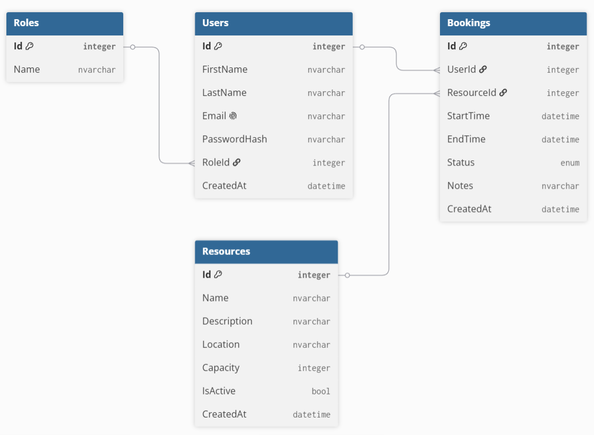

# BookingSystem API

This project demonstrates a production-like ASP.NET Core API with authentication, authorization, background jobs, database constraints, and business rules.

A RESTful API built with ASP.NET Core for managing bookings, resources, users, and roles.

## Overview

The project demonstrates modern backend practices including layered architecture, JWT authentication, role-based authorization, background processing, relational database constraints, automated testing, and clean API design.

### Example Booking Flow

```
1. User creates a booking
2. System validates time and availability
3. Booking is stored with status `Active`
4. Background service automatically updates expired bookings to `Completed`
5. User or admin can cancel or complete bookings manually
```

## Key Features

- Booking management with conflict detection (no overlapping bookings)
- Clean layered architecture (Controllers, Services, DTOs)
- CRUD operations for bookings, users, roles, and resources
- Booking status lifecycle (`Active`, `Cancelled`, `Completed`)
- Background service for automatic booking status updates
- Validation rules to ensure data integrity
- Database-level constraints for critical data integrity rules
- Restricted delete behavior for related entities
- Case-insensitive email uniqueness using normalized email addresses
- Pagination and filtering support
- JWT authentication
- Role-based authorization (RBAC)
- Ownership validation
- Global error handling
- Clean API routes
- Seed data for easy setup
- Automated unit and relational database tests

## Tech Stack

- .NET 10
- ASP.NET Core Web API
- Entity Framework Core **10.0.11**
- SQL Server
- SQLite (relational database constraint tests)
- xUnit
- Swagger / OpenAPI
- C#

## Getting Started

### What happens on startup

When running in the Development environment:

- Pending database migrations are applied
- Default `Admin` and `User` roles are created if missing
- A development admin user is created if missing

### 1. Clone the repository

```bash
git clone https://github.com/PauGoSi/BookingSystem.Api
cd BookingSystem.Api/
```

### 2. Apply database migrations

```bash
dotnet restore
dotnet ef database update
```

### 3. Run the application

```bash
dotnet run
```

## API Documentation

Swagger UI is available when running the application.

Typically:

```bash
https://localhost:7223/swagger
```

Note: The port may vary depending on your local setup.

## Authentication (JWT)

### How authentication works

1. User logs in via:

```
POST /api/auth/login
```

2. Copy the returned JWT token.
3. Click the **Authorize** button in Swagger UI.
4. A popup window will appear. Enter:

```bash
Bearer YOUR_TOKEN_HERE
```

5. Click the `Authorize` button in the popup window.
6. Click Close to close the popup window.
7. The user is now authenticated and can make requests until the JWT token expires after 60 minutes.
8. Expired JWT tokens are rejected by the API. Users must log in again to obtain a new valid token.

## Default Admin Login (Development)

In the Development environment, a default admin user is created if it does not already exist.

The admin email defaults to:

```text
admin@bookingsystem.local
```
The development admin password is not stored in the repository. Configure it locally using .NET User Secrets:

```bash
dotnet user-secrets set "DevelopmentAdmin:Password" "YOUR_DEVELOPMENT_PASSWORD"
```
The admin email can optionally be overridden using:
```bash
dotnet user-secrets set "DevelopmentAdmin:Email" "YOUR_ADMIN_EMAIL"
```
The development admin account is seeded only when the application runs in the Development environment.

## Security Notes

- JWT signing keys and development admin credentials are not stored in the repository
- Local development secrets are managed using .NET User Secrets
- Production environments should use an appropriate secret-management solution or environment variables
- Passwords are hashed using ASP.NET Core Identity utilities
- Email addresses are normalized before uniqueness checks
- A unique database index on `NormalizedEmail` provides database-level protection against duplicate email addresses

## Running Tests

The solution includes a dedicated xUnit test project:

- `BookingSystem.Api.Tests`

### Test Stack

- xUnit
- Entity Framework Core InMemory Provider
- Entity Framework Core SQLite Provider

### Run Tests

```bash
dotnet test
```

The current test suite contains **43 automated tests** covering service-layer business logic and relational database constraints.

### Notes

The required NuGet packages are already included in the test project and will automatically be restored when running:

```bash
dotnet restore
```

The EF Core InMemory provider is used for isolated service-layer tests.

SQLite is used for relational database tests because, unlike the InMemory provider, it enforces relational concepts such as foreign keys and check constraints. This allows database-level constraints and restricted delete behavior to be tested without requiring a SQL Server instance.

## Core Dependencies

| Package | Purpose |
|---|---|
| `Microsoft.AspNetCore.Authentication.JwtBearer` | JWT Bearer authentication and token validation |
| `Microsoft.EntityFrameworkCore.SqlServer` | SQL Server database provider for Entity Framework Core |
| `Microsoft.EntityFrameworkCore.Tools` | EF Core migration and database tooling |
| `Microsoft.EntityFrameworkCore.Design` | Design-time support for Entity Framework Core |
| `Microsoft.EntityFrameworkCore.InMemory` | In-memory database provider used for isolated service tests |
| `Microsoft.EntityFrameworkCore.Sqlite` | Relational database provider used for database constraint tests |
| `Swashbuckle.AspNetCore` | Swagger/OpenAPI documentation generation |
| `Swashbuckle.AspNetCore.SwaggerUI` | Interactive Swagger UI for testing API endpoints |

All package references are managed through the project `.csproj` files and are automatically restored using:

```bash
dotnet restore
```

## ER Diagram



## Data Model

- A **User** has one **Role**
- A **Booking** belongs to one **User**
- A **Booking** uses one **Resource**

## API Endpoints

### Bookings

- `GET /api/bookings`
- `GET /api/bookings?page=1&pageSize=10`
- `GET /api/bookings?resourceId=1`
- `GET /api/bookings?userId=1`
- `GET /api/bookings?fromDate=2026-05-01&toDate=2026-05-31`

`BookingStatus` API endpoint URL supports string representations of enum values.

- `GET /api/bookings?status=Active`
- `GET /api/bookings?status=Cancelled`
- `GET /api/bookings?status=Completed`

Using string values (e.g. `Completed`) is recommended for better readability and maintainability.

- `POST /api/bookings`
- `PATCH /api/bookings/{id}/cancel`
- `PATCH /api/bookings/{id}/complete`
- `GET /api/bookings/{id}`
- `PUT /api/bookings/{id}`
- `DELETE /api/bookings/{id}`

### Users

- `GET /api/users`
- `POST /api/users`
- `GET /api/users/{id}`
- `PUT /api/users/{id}`
- `DELETE /api/users/{id}`

### Roles

- `GET /api/roles`
- `POST /api/roles`
- `GET /api/roles/{id}`
- `PUT /api/roles/{id}`
- `DELETE /api/roles/{id}`

### Resources

- `GET /api/resources`
- `POST /api/resources`
- `GET /api/resources/{id}`
- `PUT /api/resources/{id}`
- `DELETE /api/resources/{id}`

## Booking Business Rules & Validation

The API enforces a set of validation rules to ensure data integrity and prevent invalid or conflicting bookings.

### Business Rules

The following rules apply:

1. **Valid Time Range**
   - `StartTime` must be earlier than `EndTime`
   - Returns `400 Bad Request` if invalid
   - Also enforced by the database through the `CK_Bookings_EndTime_After_StartTime` check constraint

2. **Valid StartTime Range**
   - `StartTime` must be in the future
   - Returns `400 Bad Request` if invalid

3. **Role Must Exist**
   - The provided `RoleId` must exist in the system
   - Returns `404 Not Found` if role does not exist

4. **User Must Exist**
   - The provided `UserId` must exist in the system
   - Returns `404 Not Found` if user does not exist

5. **User `Email` Must be Unique**
   - Email addresses are trimmed and normalized before comparison
   - Email uniqueness is case-insensitive
   - A unique database index on `NormalizedEmail` provides database-level enforcement
   - Returns `409 Conflict` if the provided email is already in use

6. **Resource Must Exist**
   - The provided `ResourceId` must exist in the system
   - Returns `404 Not Found` if resource does not exist

7. **Booking Must Exist**
   - The provided `BookingId` must exist in the system
   - Returns `404 Not Found` if booking does not exist

8. **The requested role to be deleted has no users**
   - The provided `RoleId` to be deleted must not have any users
   - Returns `409 Conflict` if users are detected
   - The database relationship also uses restricted delete behavior

9. **The requested user to be deleted has no bookings**
   - The provided `UserId` to be deleted must not have any bookings
   - Returns `409 Conflict` if bookings are detected
   - The database relationship also uses restricted delete behavior

10. **The requested resource to be deleted has no bookings**
    - The provided `ResourceId` to be deleted must not have any bookings
    - Returns `409 Conflict` if bookings are detected
    - The database relationship also uses restricted delete behavior

11. **No Overlapping Bookings**
    - A resource cannot be double-booked within overlapping time ranges
    - Returns `409 Conflict` if overlap is detected

12. **The requested resource to be booked must be Active**
    - The resource must have `IsActive = true`
    - Returns `400 Bad Request` if inactive

13. **The requested role name to be created should not already be in use**
    - A newly created role must have a unique name
    - Returns `409 Conflict` if a role name already exists in the system

14. **A booking cannot be cancelled more than once**
    - The specified `BookingId` must not already have the status `Cancelled`
    - Returns `400 Bad Request` if the booking is already cancelled

15. **Completed bookings cannot be cancelled**
    - The specified `BookingId` must not already have the status `Completed`
    - Returns `400 Bad Request` if the booking is already completed

16. **Cancelled bookings cannot be completed**
    - The specified `BookingId` must not already have the status `Cancelled`
    - Returns `400 Bad Request` if the booking is already cancelled

17. **Booking cannot be completed before EndTime has passed**
    - The specified `BookingId` can only be completed if `EndTime` is in the past
    - Returns `400 Bad Request` if `EndTime` is not in the past

18. **A booking cannot be completed more than once**
    - The specified `BookingId` must not already have the status `Completed`
    - Returns `400 Bad Request` if the booking is already completed

19. **Resource Capacity Must Be Positive**
    - `Capacity` must be greater than `0`
    - Enforced at database level through the `CK_Resources_Capacity_Positive` check constraint

---

**Successful Booking**

For creating a booking (`POST /api/bookings`):
- If validations 1., 2., 4., 6., 11., and 12. pass, the booking is created successfully
- Returns `201 Created` with the created booking

For cancelling a booking (`PATCH /api/bookings/{id}/cancel`):
- If validations 7., 14., and 15. pass, the booking is cancelled successfully
- Returns `204 No Content`

For completing a booking (`PATCH /api/bookings/{id}/complete`):
- If validations 7., 16., 17., and 18. pass, the booking is completed successfully
- Returns `204 No Content`

For updating an existing booking (`PUT /api/bookings`):
- If validations 1., 2., 4., 6., 11., and 12. pass, the existing booking is updated successfully
- Returns `204 No Content`
- Note: Completed and cancelled bookings are immutable and cannot be modified.

For deleting an existing booking (`DELETE /api/bookings`):
- If validation 7. passes, the existing booking is deleted successfully
- Returns `204 No Content`

---

**Successful Resource**

For creating a resource (`POST /api/resources`):
- If validation 19. passes, the resource is created successfully
- Returns `201 Created` with the created resource

For updating an existing resource (`PUT /api/resources`):
- If validations 6. and 19. pass, the existing resource is updated successfully
- Returns `204 No Content`

For deleting an existing resource (`DELETE /api/resources`):
- If validations 6. and 10. pass, the existing resource is deleted successfully
- Returns `204 No Content`

---

**Successful User**

For creating a user (`POST /api/users`):
- If validations 3. and 5. pass, the user is created successfully
- Returns `201 Created` with the created user

For updating an existing user (`PUT /api/users`):
- If validations 3., 4., and 5. pass, the existing user is updated successfully
- Returns `204 No Content`

For deleting an existing user (`DELETE /api/users`):
- If validations 4. and 9. pass, the existing user is deleted successfully
- Returns `204 No Content`

---

**Successful Role**

For creating a role (`POST /api/roles`):
- If validation 13. passes, the role is created successfully
- Returns `201 Created` with the created role

For updating an existing role (`PUT /api/roles`):
- If validations 3. and 13. pass, the existing role is updated successfully
- Returns `204 No Content`

For deleting an existing role (`DELETE /api/roles`):
- If validations 3. and 8. pass, the existing role is deleted successfully
- Returns `204 No Content`

---

### Example Error Response

```json
{
  "error": "Resource is already booked in this time range."
}
```

This project follows a clean, layered architecture with clear separation of concerns.

### Core Layers

- **Controllers**
  Handle HTTP requests and responses.
  Responsible for routing, model binding, and returning appropriate HTTP status codes.

- **Services**
  Contain business logic and validation rules.
  Keep controllers thin and logic reusable and testable.

- **DTOs (Data Transfer Objects)**
  Define API input/output models.
  Prevent direct exposure of domain entities.

- **Data (DbContext)**
  Handles database access and relational configuration using Entity Framework Core.

### Supporting Layers

- **Enums**
  Strongly-typed domain values (e.g. `BookingStatus`).
  Improve readability and prevent invalid states.

- **Middleware**
  Handles cross-cutting concerns such as global error handling.
  Ensures consistent API responses.

- **BackgroundServices**
  Executes background processes independently of HTTP requests.
  Example: Automatically marks expired bookings as `Completed`.

- **Seed (DbSeeder)**
  Seeds initial data such as roles and a development admin user.
  Ensures the system is usable immediately after setup.

- **Migrations**
  Version database schema changes using Entity Framework Core migrations.
  Includes database constraints, indexes, and relationship configuration.

### Design Principles

- Separation of concerns
- Thin controllers
- Centralized business logic
- Defense in depth through service-level validation and database constraints
- Secure-by-default API design
- Scalable and maintainable structure

## Time Handling

All timestamps are stored and processed in **UTC** (`DateTime.UtcNow`).

- Avoids issues with time zones and daylight saving time
- Ensures consistent behavior across environments
- Clients are responsible for converting to local time

## Authentication & Authorization

This API uses **JWT (JSON Web Token)** authentication with **role-based access control (RBAC)**.

All protected endpoints require a valid JWT access token.

## Authorization (RBAC)

Access is controlled using user roles and ownership-based authorization rules.

| Role | Permissions |
|---|---|
| Admin | Full access to all resources and bookings |
| User | Limited access to own bookings and profile |

## Booking Authorization Rules

### User Permissions

Authenticated users can:

- Create bookings
- View their own bookings
- Cancel their own active bookings

Authenticated users cannot:

- Access other users' bookings
- Cancel other users' bookings
- Manually complete bookings

### Admin Permissions

Admins can:

- Access all bookings
- Cancel any booking
- Manually complete bookings
- Manage users, roles, and resources

## Booking Business Rules

The API enforces several business rules for booking lifecycle management:

- Users can only access and manage their own bookings
- Admins can access and manage all bookings
- Completed bookings cannot be cancelled
- Cancelled bookings cannot be completed
- Bookings cannot be completed before `EndTime` has passed
- Only admins can manually complete bookings
- Booking conflicts are prevented for overlapping time periods

## Resource Authorization

### Read Access

- All authenticated users can view resources

### Write Access

Only admins can:

- Create resources
- Update resources
- Delete resources

## User & Role Management

User and role management endpoints are restricted to admins only.

## Security

Authorization, validation, and data integrity rules are enforced at multiple layers:

- At controller level using `[Authorize]` attributes
- Within the service layer using business-rule validation
- At database level using unique indexes, check constraints, foreign keys, and restricted delete behavior

This defense-in-depth approach protects critical data integrity rules even if data is written through a path other than the normal API service flow.